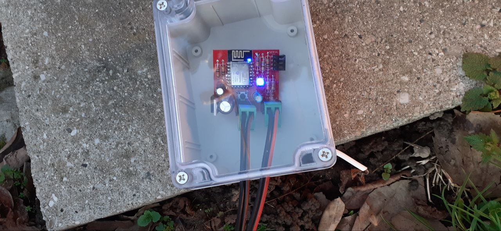
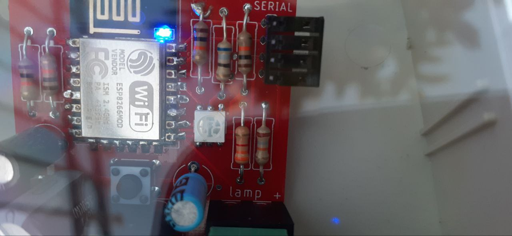

This board, designed with an ESP8266 and programmed in Arduino, is capable of reading a 12V input and sending an MQTT message with the input status.  
  
  
  
It was used to remotely check the status of the gate light, which was not connected to any indicator inside the house. Without an indoor indicator for the open gate, it was impossible to determine its status and automate the garden lights and other functions. 
  
  
  
However, thanks to this board, it is now possible to implement automation when the gate is opened or closed.